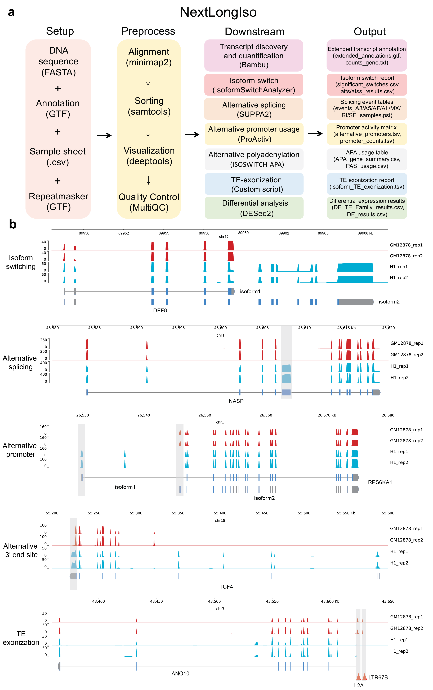

# 🧬 NextLongIso: a comprehensive Nextflow pipeline for multi-dimensional long-read RNA-seq analysis

NextLongIso is a modular Nextflow pipeline for streamlined, reproducible, and scalable analysis of long-read RNA-seq data from PacBio Iso-Seq and Oxford Nanopore platforms. It integrates all major analysis steps,from read alignment and bigWig generation to isoform quantification, alternative splicing, alternative polyadenylation (APA), alternative promoter usage, and transposable element (TE) analysis, by using state-of-the-art tools and custom scripts.

🧭 Workflow Overview

Below is the schematic overview of the NextLongIso pipeline:



Figure 1. Overview of the NextLongIso pipeline, showing read alignment, isoform quantification, alternative promoter usage, APA, alternative splicing, and TE exonization/differential expression analysis.

✳️ Key Features

* **End-to-end automation** of long-read RNA-seq analysis from FASTQ to results.
* **Supports multiple platforms:** Fully compatible with both **PacBio** and **Nanopore** long-read data.
* **Integrated analysis tools:** Utilizes minimap2, samtools, deeptools, Bambu, DESeq2, IsoformSwitchAnalyzer, SUPPA2, ProActiv, bedtools and custom scripts.
* **Containerized environment:** Uses Singularity/Apptainer with pre-built images from Docker Hub.
* **Fully modular, reproducible, and scalable**—features overridable reference paths, making it ideal for large datasets and HPC environments.

🧩 Installation

To run NextLongIso, you need **Nextflow (≥ 25.10.0)** and **Apptainer** or **Singularity. Internet access is required on the first run to pull containers (~several GB total).

1. Install via Conda (Recommended). Note that Python versions 3.11 - 3.13 are natively supported.

```bash
# Create and activate environment
conda create -n nf-LongIso \
    nf-longiso \
    nextflow \
    apptainer \
    openjdk=17 \
    graphviz \
    -y \
    -c conda-forge \
    -c bioconda \
    -c defaults
conda activate nf-LongIso
```

2. Install via Pip

```bash
pip install --user --no-cache-dir nf-LongIso
```

3. Manual Installation (Build from Source)

```bash
git clone https://github.com/YidanSunResearchLab/nf-LongIso.git
cd nf-LongIso
conda create -n nf-LongIso -c conda-forge python=3.13
conda activate nf-LongIso
pip install .
```


🧪 Quick Start

**1. Clone the Repository**

```bash
git clone https://github.com/YidanSunResearchLab/nf-LongIso.git
cd nf-LongIso
```

**2. Prepare your samplesheet**
See the example `samplesheet.csv` provided in the data/ repository for the expected format.

🚀 Quick Start for your own genome and sequencing data

**Step 1. Prepare Reference Files (GRCh38/hg38 example)**

You will need the Genome FASTA, Gene annotation GTF, and TE annotation GTF. Ensure your fasta and gtf are from the same assembly (e.g., GRCh38.p14 → Gencode v38+).
* **Genome FASTA:** Download from Ensembl or UCSC (primary assembly).
* **Gene GTF:** Download from Gencode (v47 or newer).
* **TE GTF:** Download from the RepeatMasker or generate from the UCSC Table Browser (hg38 → Repeats → RepeatMasker → GTF output).

**Step 2. Process Long-Read Data**

Run the NextLongIso pipeline with your reference files:

```bash
nextflow run main.nf \
  -profile singularity \
  --input_type fastq \
  --genome /Absolute/path/to/GRCh38.primary_assembly.fa \
  --gtf /Absolute/path/to/gencode.v47.annotation.gtf \
  --te_gtf /Absolute/path/to/TEtranscripts_hg38.gtf \
  --samplesheet /Absolute/path/to/samplesheet.csv \
  -resume
```
*Note: The `-resume` flag reuses previous computations if nothing changed, saving significant time.*

💡 Troubleshooting

* **Pull fails?** Check your internet connection and ensure your Singularity/Apptainer version is up to date (≥ 3.8).
* **Reference mismatch?** Ensure your FASTA and GTF are from the exact same assembly build.

🛠 Maintenance and Support

NextLongIso is actively maintained by the Sun Lab. We are committed to maintaining and improving the software.
Maintenance activities include:
* Updating software dependencies
* Fixing reported bugs
* Improving compatibility with new systems and sequencing technologies
* Implementing usability improvements when appropriate

We also welcome community contributions. Users are encouraged to:
* Report issues via the GitHub **Issues** page
* Suggest new features
* Contribute improvements through **Pull Requests**

While we aim to maintain long-term support for NextLongIso, development priorities may evolve as the software and research needs grow.

🧾 Citation

If you use NextLongIso in your work, please cite:
* **This repository:** [https://github.com/YidanSunResearchLab/nf-LongIso.git](https://github.com/YidanSunResearchLab/nf-LongIso.git)
* **The individual tools used within the pipeline:** minimap2, samtools, deeptools, Bambu, SUPPA2, IsoformSwitchAnalyzer, ProActiv, DESeq2, bedtools, etc.

⚖️ License

MIT LICENSE.